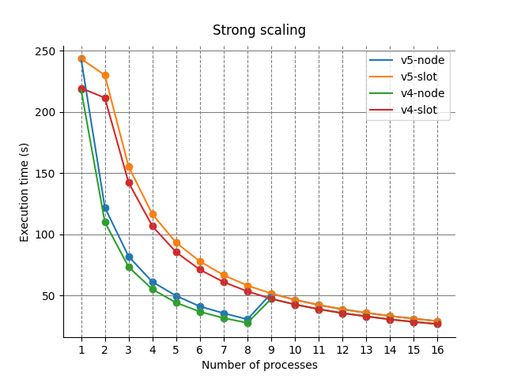
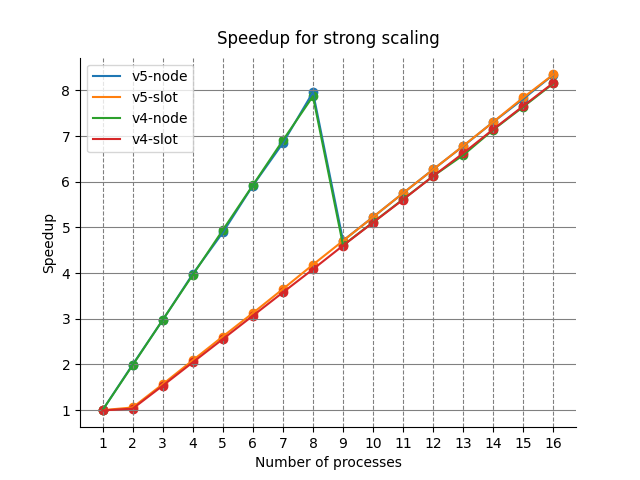
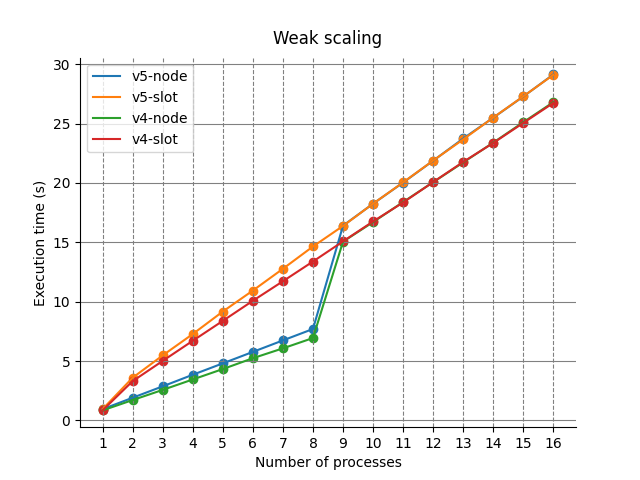

# N-Body - Marco D'Antonio
## Introduzione
L'obiettivo di questo progetto è risolvere il problema N-Body, presentando sia una soluzione che utilizzi le funzionalità di MPI, sia l'analisi delle sue prestazioni su un cluster ospitato su AWS.

### Il problema
Il problema N-Body consiste nel determinare le posizioni e le velocità di un insieme di particelle nel tempo. Si simula quindi il comportamento di queste particelle implementando le formule per il calcolo delle posizioni e delle velocità.

## Testing della soluzione
La soluzione può essere eseguita ed è stata testata in un ambiente con OpenMPI il compilatore GCC, in particolare per quanto riguarda l'ambiente Docker MPI, il container dovrà essere lanciato con l'opzione `--privileged`. Il file sorgente dovrà essere compilato eseguendo:
```bash
mpicc -O3 nbody.c -o nbody.out -lm
```
e poi eseguito lanciando `mpirun`. Segue un esempio di esecuzione del programma con due processi: il primo argomento dopo il nome del programma stabilisce il numero di iterazioni della simulazione, mentre il secondo argomento il numero di particelle.
```bash
mpirun --allow-run-as-root -np 2 nbody.out 100 1000
```
È possibile definire all'interno del file sorgente una macro `DEBUG` per visualizzare alla fine dell'esecuzione il risultato della simulazione, che per semplicità stamperà a video la posizione `x` di ciascuna particella.
```c
#define DEBUG
```

## Presentazione della soluzione
La soluzione presentata compie un numero di passi quadratico rispetto al numero di particelle che viene fornito in input.

Per lo sviluppo della soluzione si è operato in forma incrementale, applicando mano a mano delle ottimizzazioni alla soluzione, per poi scegliere la migliore in termini di performance. 

La soluzione finale è ora descritta sinteticamente e ad alto livello.
1. Ogni processo inizializza l'intero array di particelle.
2. Ad ogni processo è assegnata una porzione di particelle di cui calcolerà il valore nelle varie iterazioni della simulazione.
3. Mentre effettua i calcoli, ogni processo attende l'arrivo delle informazioni delle altre particelle dagli altri processi.
4. Una volta finiti i calcoli per l'iterazione corrente, ogni processo invia i suoi dati a tutti gli altri processi.
5. Prima di passare all'iterazione successiva, ogni processo attende che le informazioni delle altre particelle siano state ricevute.

## Descrizione della soluzione
Verrà ora fornita una descrizione della soluzione più dettagliata, ognuna delle sezioni farà riferimento ad uno dei cinque passi della soluzione esposti nella sua presentazione.

### Inizializzazione
Le particelle vengono inizializzate casualmente da ogni processo, tuttavia, tutti i processi inizializzano il generatore pseudocasuale utilizzando lo stesso seme, questo assicura sia che i risultati siano corretti, sia la riproducibilità degli esperimenti.

```c
typedef struct body {
  float x, y, z, vx, vy, vz; 
} Body;

...

void randomizeBodies(float *data, int n) {
  for (int i = 0; i < n; i++) {
    data[i] =  20.0f * (rand() / (float)RAND_MAX) - 10.0f;
  }
}

...

int bytes = nBodies * sizeof(Body);
Body *computationBodies = malloc(bytes);
Body *receiveBodies = malloc(bytes);

randomizeBodies((float *) computationBodies, 6 * nBodies);
```
Durante questa fase vengono allocati due array di `Body`, in quanto il primo, `computationBodies`, viene utilizzato per mantenere le particelle su cui si stanno effettuando i calcoli, mentre l'altro, `receiveBodies`, viene utilizzato per mantenere le particelle che vengono ricevute dagli altri processi, questa distinzione è necessaria in quanto la ricezione, essendo non bloccante (come si vedrà più avanti) potrebbe avvenire durante il calcolo.

### Distribuzione del carico
La porzione di array a cui ogni processo è assegnato viene calcolata in base al rango del processo all'interno del communicator, in base al numero di processi nel communicator e in base al numero di particelle da calcolare. Sono state definite tre macro che prendono in input questi valori e forniscono il numero di particelle su cui un processo si deve concentrare e l'indice di inizio e di fine della sua parte all'interno dell'array di particelle.

```c
int *receiveCounts = malloc(sizeof(int) * commSize);
int *displacements = malloc(sizeof(int) * commSize);
for (int i = 0; i < commSize; i++) {
  receiveCounts[i] = workload(i, commSize, nBodies);
  displacements[i] = startIndex(i, commSize, nBodies);
}
```
Gli array che mantengono le informazioni sul carico sono inizializzati per tutti i processi, questo perché queste informazioni sono utili a tutti nella fase di ricezione per definire dove i dati debbano essere inseriti e in che numero essi siano.

### Calcolo e ricezione
La ricezione dei dati avviene in modalità non bloccante e i dati ricevuti vengono inseriti all'interno dell'array `receiveBodies` visto in precedenza. Successivamente, vengono effettuati i calcoli per stabilire i valori della porzione di array assegnata per l'iterazione attuale.

```c
int start = startIndex(rank, commSize, nBodies);
int end = endIndex(rank, commSize, nBodies);

MPI_Request *receiveRequests = malloc(sizeof(MPI_Request) * (commSize - 1));
MPI_Request *sendRequests = malloc(sizeof(MPI_Request) * (commSize - 1));
for (int iter = 1; iter <= nIters; iter++) {

  for (int i = 0, j = 0; i < commSize; i++) 
    if (i != rank)
      MPI_Irecv(&receiveBodies[displacements[i]], receiveCounts[i], body, i, DATA_TAG, MPI_COMM_WORLD, &receiveRequests[j++]);

  for (int i = start; i < end; i++) { 
    float Fx = 0.0f;
    float Fy = 0.0f;
    float Fz = 0.0f;

    for (int j = 0; j < nBodies; j++) {
      float dx = computationBodies[j].x - computationBodies[i].x;
      float dy = computationBodies[j].y - computationBodies[i].y;
      float dz = computationBodies[j].z - computationBodies[i].z;
      float distSqr = dx * dx + dy * dy + dz * dz + SOFTENING;
      float invDist = 1.0f / sqrtf(distSqr);
      float invDist3 = invDist * invDist * invDist;

      Fx += dx * invDist3;
      Fy += dy * invDist3;
      Fz += dz * invDist3;
    }

    computationBodies[i].vx += dt * Fx;
    computationBodies[i].vy += dt * Fy;
    computationBodies[i].vz += dt * Fz;
  }

  for (int i = start; i < end; i++) {
    computationBodies[i].x += computationBodies[i].vx * dt;
    computationBodies[i].y += computationBodies[i].vy * dt;
    computationBodies[i].z += computationBodies[i].vz * dt;
  }

  ...

} // end for
```

### Invio dati
Dopo il calcolo dei valori per l'iterazione attuale, i dati vengono inviati a tutti gli altri processi, assicurandosi prima che tutti l'invio dell'iterazione precedente sia stato effettuato.

```c
for (int iter = 1; iter <= nIters; iter++) {

  ...

  if (iter != 1)
    MPI_Waitall(commSize - 1, sendRequests, MPI_STATUSES_IGNORE);

  for (int i = 0, j = 0; i < commSize; i++)
    if (i != rank) 
      MPI_Irsend(&computationBodies[displacements[rank]], receiveCounts[rank], body, i, DATA_TAG, MPI_COMM_WORLD, &sendRequests[j++]);    
  
  ...
  
} //end for
```
Anche l'invio dei dati è effettuato in maniera non bloccante, e in particolare si può sfruttare un invio in modalità ready, poiché la receive corrispondente è già stata inviata dagli altri processi all'inizio dell'iterazione.

### Preparazione iterazione successiva
In quest'ultimo passo vengono effettuate tre operazioni fondamentali: 
1. Il processo attende che eventuali receive vengano completate. Si noti come non necessariamente si dovrà aspettare: la receive in modalità non bloccante viene effettuata prima della fase di computazione, quindi è possibile che i risultati siano già arrivati al processo.
2. Si effettua la copia della porzione di array che il processo attuale ha calcolato dal buffer di calcolo `computationBodies` al buffer di ricezione `receiveBodies`.
3. Si effettua uno scambio degli indirizzi a cui puntano `computationBodies` e `receiveBodies`, in questo modo nella prossima iterazione `computationBodies` conterrà i dati calcolati da tutti gli altri processi (e dal processo attuale) durante l'iterazione attuale.
```c
for (int iter = 1; iter <= nIters; iter++) {

  ...    
  
  MPI_Waitall(commSize - 1, receiveRequests, MPI_STATUSES_IGNORE);

  memcpy(&receiveBodies[displacements[rank]], &computationBodies[displacements[rank]], sizeof(Body) * receiveCounts[rank]);

  swap((void **) &computationBodies, (void **) &receiveBodies);
} //end for
```
## Correttezza della soluzione
La correttezza dei risultati è stata verificata confrontando le versioni realizzate con la versione sequenziale. Chiaramente, vista la possibile quantità di calcoli e di dati in gioco, si è verificata la correttezza su quantità di dati ridotte. I dati da un'esecuzione all'altra non cambiano, essendo generati pseudocasualmente con lo stesso seme per ogni esecuzione.

## Analisi delle prestazioni
Come detto in precedenza, lo sviluppo della soluzione è stato effettuato in maniera incrementale, questo ha permesso di comparare (seppur in locale) le performance delle varie versioni della soluzione. La soluzione descritta nella sezione precedente è quindi la migliore in termini di performance. 

Tuttavia, all'interno di questa analisi, la soluzione proposta verrà comparata anche con un'altra soluzione che risolve il problema (la soluzione è consultabile nell'archivio). Il modo in cui quest'ultima soluzione opera è simile a quella presentata se non che, piuttosto che forzatamente aspettare alla fine di ogni iterazione l'arrivo dei dati dagli altri processi, questa procede alla prossima iterazione, mano a mano operando sui dati che arrivano dagli altri processori.

Gli esperimenti sono stati effettuati su un numero massimo di otto istanze `m4.large`, ognuna delle quali ospita nella configurazione di default un singolo CPU core, che esegue in multithreading due thread, i quali sono visibili all'applicazione come (virtual) CPU. Per questa ragione, gli esperimenti di weak e strong scaling sono stati ripetuti in due modi: prima con un mapping dei processi per nodo e poi per slot. Nel primo mapping viene lanciato un processo per nodo, iterando su di essi, mentre nel secondo mapping vengono prima saturati i singoli nodi.

Nei grafici che seguono, la soluzione proposta verrà indicata con `v4`, mentre l'altra soluzione verrà indicata con `v5`. Gli esperimenti sono stati effettuati considerando un numero di iterazioni pari a 100 e un numero di particelle massimo pari a 20000. Entrambe le soluzioni sono state compilate con il flag di ottimizzazione `-O3`.

### Strong scaling
Il comportamento in termini di strong scaling della soluzione può essere visionato nel grafico sottostante, inoltre sono riportate la tabella con i tempi di esecuzione di entrambe le versioni della soluzione. 


#### Tabella strong scaling v4
|Processes|Time (s) By Node|Time (s) By Slot|Bodies|Iterations|
|:---:|:-------------:|:-------------:|:-----:|:---:|
|  1  |  218.158710   |  219.412389   | 20000 | 100 |
|  2  |  109.912699   |  211.420546   | 20000 | 100 |
|  3  |   73.317767   |  142.180747   | 20000 | 100 |
|  4  |   55.082430   |  106.643035   | 20000 | 100 |
|  5  |   44.139954   |   85.355169   | 20000 | 100 |
|  6  |   36.813012   |   71.133945   | 20000 | 100 |
|  7  |   31.581320   |   60.972037   | 20000 | 100 |
|  8  |   27.704535   |   53.402552   | 20000 | 100 |
|  9  |   47.316738   |   47.391574   | 20000 | 100 |
| 10  |   42.657051   |   42.702920   | 20000 | 100 |
| 11  |   38.826832   |   38.882741   | 20000 | 100 |
| 12  |   35.617101   |   35.613565   | 20000 | 100 |
| 13  |   33.126833   |   32.917727   | 20000 | 100 |
| 14  |   30.549123   |   30.507414   | 20000 | 100 |
| 15  |   28.536623   |   28.469944   | 20000 | 100 |
| 16  |   26.748812   |   26.707109   | 20000 | 100 |


#### Tabella strong scaling v5
|Processes|Time (s) By Node|Time (s) By Slot|Bodies|Iterations|
|:---:|:-------------:|:-------------:|:-----:|:---:|
|  1  |  243.352486   |  243.352486   | 20000 | 100 |
|  2  |  121.906104   |  229.968569   | 20000 | 100 |
|  3  |   81.907818   |  155.275747   | 20000 | 100 |
|  4  |   61.136194   |  116.380243   | 20000 | 100 |
|  5  |   49.765549   |   93.154542   | 20000 | 100 |
|  6  |   41.118755   |   77.850461   | 20000 | 100 |
|  7  |   35.531384   |   66.625357   | 20000 | 100 |
|  8  |   30.562832   |   58.134904   | 20000 | 100 |
|  9  |   51.651247   |   51.68622    | 20000 | 100 |
| 10  |   46.537395   |   46.538289   | 20000 | 100 |
| 11  |   42.304046   |   42.290434   | 20000 | 100 |
| 12  |   38.79915    |   38.807365   | 20000 | 100 |
| 13  |   35.879529   |    35.8501    | 20000 | 100 |
| 14  |   33.285603   |   33.280112   | 20000 | 100 |
| 15  |   31.125759   |   31.011883   | 20000 | 100 |
| 16  |   29.15112    |   29.136822   | 20000 | 100 |

Viene inoltre anche riportato il grafico che mostra lo speedup delle soluzioni.


### Weak scaling
Il comportamento in termini di weak scaling della soluzione può essere visionato nel grafico sottostante, anche qui sono riportate la tabella con i tempi di esecuzione di entrambe le versioni della soluzione.


#### Tabella weak scaling v4
|Processes|Time (s) By Node|Time (s) By Slot|Bodies|Iterations|
|-----|---------------|---------------|-------|-----|
|1    |0.849502       |0.849599       |1250   |100  |
|2    |1.719401       |3.309983       |2500   |100  |
|3    |2.574388       |5.015560       |3750   |100  |
|4    |3.453151       |6.709647       |5000   |100  |
|5    |4.329359       |8.387072       |6250   |100  |
|6    |5.243546       |10.079795      |7500   |100  |
|7    |6.074259       |11.723718      |8750   |100  |
|8    |6.942467       |13.386046      |10000  |100  |
|9    |15.060218      |15.080686      |11250  |100  |
|10   |16.704346      |16.758822      |12500  |100  |
|11   |18.395322      |18.357317      |13750  |100  |
|12   |20.068630      |20.076190      |15000  |100  |
|13   |21.731069      |21.775111      |16250  |100  |
|14   |23.398230      |23.370446      |17500  |100  |
|15   |25.120434      |25.058991      |18750  |100  |
|16   |26.807293      |26.743134      |20000  |100  |

#### Tabella weak scaling v5
|Processes|Time (s) By Node|Time (s) By Slot|Bodies|Iterations|
|:---:|:-------------:|:-------------:|:-----:|:---:|
|  1  |   0.951782    |   0.951782    | 1250  | 100 |
|  2  |   1.914786    |   3.597865    | 2500  | 100 |
|  3  |   2.874772    |   5.478913    | 3750  | 100 |
|  4  |   3.849105    |   7.277437    | 5000  | 100 |
|  5  |    4.80954    |   9.172566    | 6250  | 100 |
|  6  |   5.775095    |    10.9406    | 7500  | 100 |
|  7  |   6.743649    |   12.772698   | 8750  | 100 |
|  8  |   7.704188    |   14.649695   | 10000 | 100 |
|  9  |   16.403856   |   16.382495   | 11250 | 100 |
| 10  |   18.253426   |   18.255228   | 12500 | 100 |
| 11  |   20.034803   |   20.048787   | 13750 | 100 |
| 12  |   21.875289   |   21.888314   | 15000 | 100 |
| 13  |   23.743068   |   23.671346   | 16250 | 100 |
| 14  |   25.497494   |   25.510403   | 17500 | 100 |
| 15  |   27.284094   |   27.295811   | 18750 | 100 |
| 16  |   29.139811   |   29.111232   | 20000 | 100 |

Dai grafici è possibile notare come la soluzione `v4` sia più veloce in termini di tempo di esecuzione rispetto alla soluzione `v5`, questo vale sia per il weak che per lo strong scaling. 

Le soluzioni sembrerebbero non scalare bene rispetto a quelle che sono le capacità hardware, infatti lo speedup massimo raggiunto con 16 processi è di circa 8 rispetto alla versione con un unico processo.

È importante notare come sia il mapping dei processi, sia l'hardware dell'istanza impatti sulle performance. Difatti, quando si effettua la strategia di mapping per nodo, quando il numero di processi è pari a 8, si raggiunge uno speedup di 8, mentre con il mapping per slot, lo speedup è dimezzato. Questo è dovuto all'hardware sottostante, in cui su ogni nodo ha effettivamente a disposizione un solo core fisico, che utilizza il multithreading per simulare due processori. 

È possibile quindi affermare che la degradazione delle performance sia riconducibile all'hardware dell'istanza su cui è stato effettuato il benchmarking. Dal grafico dello speedup è possibile anche notare come l'overhead di comunicazione sia quasi assente quando si ha un mapping per nodo, risultando quindi molto vicino al limite superiore del numero di processi.

Infine, è interessante notare come la soluzione `v5` nonostante in termini di tempo di esecuzione sia peggiore, quando viene effettuato un mapping per slot (e quindi in un ambiente in cui vi è meno parallelismo) ha uno speedup leggermente maggiore rispetto alla soluzione `v4`. Questo è probabilmente causato dal fatto che quest'ultima deve necessariamente aspettare che tutti i dati siano arrivati dagli altri processi prima di procedere alla prossima iterazione, mentre la soluzione `v5` può passare alla prossima iterazione operando solo sui dati che ha già ricevuto, il che risulta essere un vantaggio quando non tutti i processi hanno finito la computazione di una certa iterazione, situazione che può essere più frequente in un ambiente meno parallelo.